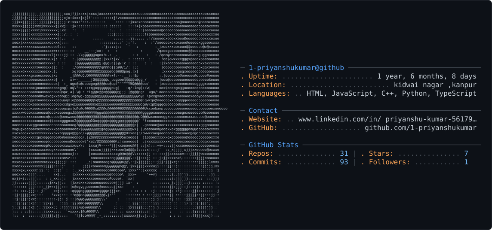

 # PRIYANSHU KUMAR
🔭 I’m currently working on AI-powered products, Full Stack Development, and Computer Vision applications.  👯 I’m looking to collaborate on Open Source, AI/ML, Full Stack, and Hackathon projects.  🤝 I’m looking for help with Cloud Architecture (AWS), DevOps, and Scalable System Design.  🌱 I’m currently learning Generative AI, LangChain, LangGraph, AWS, Docker, Kubernetes, and Microservices.  💬 Ask me about Java, Python, React, SQL, DSA, AI, Machine Learning, and Web Development.  ⚡ Fun fact: I enjoy solving challenging coding problems, building AI applications, and continuously exploring new technologies.
<picture>
  <source media="(prefers-color-scheme: dark)" srcset="dark_mode.svg" />
  <source media="(prefers-color-scheme: light)" srcset="light_mode.svg" />
  
</picture>

## 🌐 Socials:
  

# 💻 Tech Stack:
                                                                               
# 📊 GitHub Stats:
 
 

---

<!-- Proudly created with GPRM ( https://gprm.itsvg.in ) -->
